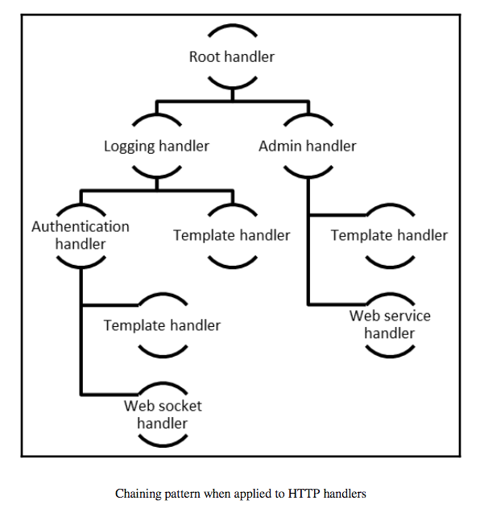
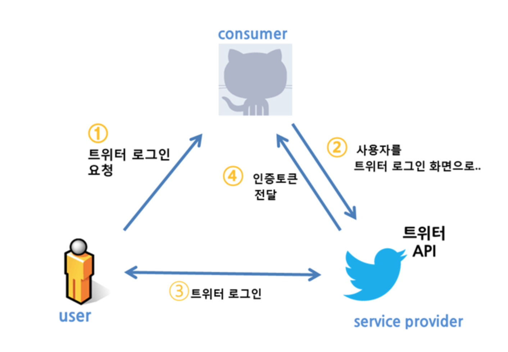

# Chapter2. Adding User Accounts

* Keyword: Authorization(허가), Authentication(인증)
* Social Login 기능: Facebook, Google, Github 등 


## 2.1 Handlers all the way down
- auth.go의 authHandler 및 MustAuth 참고
- main.go의 http.Handler 수정



```go
func (h *authHandler) ServeHTTP(w http.ResponseWriter, r *http.Request) {...}
```

- 일종의 미들웨어 구현 가능
	- authHandler struct에 next http.Handler가 있어서 chaining 가능
	- `http.Handler`: 다음과 같은 메서드를 갖는 인터페이스 [예제로 배우는 Go 프로그래밍](http://golang.site/go/article/111-%EA%B0%84%EB%8B%A8%ED%95%9C-%EC%9B%B9-%EC%84%9C%EB%B2%84-HTTP-%EC%84%9C%EB%B2%84)
	```go
    type Handler interface {
    	ServeHTTP(ResponseWriter, *Request)
	}
	```

  - Handler란?
    - [http 패키지 문서 내 Handler 설명](https://golang.org/pkg/net/http/#Handler)

## 2.2 Making a pretty social sign-in page
- Bootstrap CDN 이용 또는 서버에서 직접 서빙 (AWS의 경우 S3, cloudfront 이용)

## 2.3 Endpoints with dynamic paths
`auth/:action/:provider_name` 와 같은 dynamic path mapping
- auth.go의 loginHandler 참고
- loginHandler에 `/auth/nonsense`로 접근한다면 에러처리는 어떻게?
```go
func loginHandler(w http.ResponseWriter, r *http.Request) {
    segs := strings.Split(r.URL.Path, "/")
    // segs의 length로 error 핸들링
    if len(segs) < 5 {
        log.Fatalf("Error")
    }
    action := segs[2]
    provider := segs[3]
    ... 
}
```

## 2.4 Getting started with OAuth2
- [사진출처: OAuth2에 대해 알아보자](https://swalloow.github.io/about-oauth2)



- gomiauth 패키지 사용

## 2.5 Implementing external loggin in
- main.go gomniauth 세팅 관련 참고

## 2.6 Logging in 
- auth.go loginHandler 수정
	- gomiauth.Provider 함수
	- GetBeginAuthURL(state, option)

- tip: 자동 리빌드 -> pilu/fresh 및 codegangsta/gin 참고

## 2.7 Handling the response from the provider
- 성공하는 경우 토큰 발행 후 callback url로 연결
`http://localhost:8080/auth/callback/google?code=4/Q92xJBQfoX6PHhzkjhgtyfLc0Ylm.QqV4u9AbA9sYguyfbjFEsNoJKMOjQI`
- auth.go callback 부분 수정
	- CompletteAuth
	- GetUser
	- then, `Base64-encode`(does not contain special characters)

## 2.8 Presenting the user data
- 같이 해보기(공부방법 공유?)
- templateHandler 변경
	- user data를 전달하도록 Execute   메서드 변경 

## 2.9 Augmentinng  messages  with additional data
- message.go에서 channel에 전달되는 message struct 변환
- client.go에서 read & write 메써드 변환
- room.go에서 forward field type, client.go에서 send chan type 변환
- room.go에서 forward, tracer, send 변환
- client struct 변환
- http.Request의 Cookie 메서드 변환
- chat.html 변환 & socket.onmessage 콜백 변환

## 2.10 Test Case
- Test testCanPostLogin
- Test testCanPostWithWrongProviderShouldFail

## 기타
- [Golang oauth2 사용법](https://mingrammer.com/getting-started-with-oauth2-in-go/)
- [Golang oauth2 공식레포](https://github.com/golang/oauth2)
	- Test case 살펴보기
- Go dependency management
	- `vendor`: 프로젝트 폴더별로 vendor 를 두고 project를 격리시키는 방법
	- [glide](http://glide.sh/): github star 6600개
		- ruby 의 gem/bundler와 비슷
		- yaml 파일로 vendor 폴더 관리
	- [godep](https://github.com/tools/godep)
		- 궁극적으로는 이거 사용하는게 추천되는 듯 (golang 개발팀이 밀고 있다)
		- github start 5300
		- 언제가는 official로 지정될 분위기, 하지만 아직까지는 glide가 완성도는 높다.
    - 참고자료
    	- [Go의 의존성 도구 Dep](https://devdotlogblog.wordpress.com/2017/09/04/go%EC%9D%98-%EC%9D%98%EC%A1%B4%EC%84%B1-%EB%8F%84%EA%B5%AC-dep/)
    	- [golang Package Manager로 dependency 관리하기](https://kihoonkim.github.io/2017/04/02/reactgo/reactgo-3-packagemanager/)